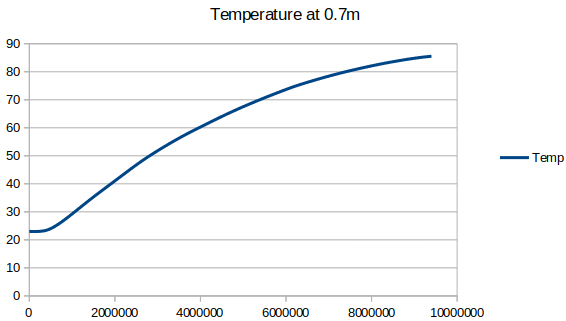

# hothothot

The purpose of this application is to use CUDA cores of an Nvidia GPU to measure heat
diffusion in an object across time. The more slices you divide an object into, the more 
accurate the result.

## Structure

### Overview

Nvidia GPUs provide us with a large number of CUDA cores which may be used to 
do lots of calculations in parallel. In this application, the user chooses to either analyze 
heat diffusion on the CPU or to divide the job up among the CUDA codes of a GPU. The only 
object shape analyzed is a one meter 1D object with an infinite heat source on the left. This 1D
object that begins at a uniform temperature. The defaults are displayed in the help text, and 
the 1D object defaults to 23 degrees whereas the heat source defaults to 100 degrees.


To approximate values at any given point in time, the user selects the number of time steps and
how many locations to slice the object into. For every time step, the next value for a location 
is the average of its two neighboring values.

### Usage

This is the help output:

```
hothothot [command] arg=value...

Commands:

    Info: displays GPU / CUDA info
    TimePoint: calculates the temperature for a given time and location
        Dimensions (DIM): 1, 2, or 3 (default 1)
        Location (L): location to measure (default 0)
        Device (DEV): set to CPU or GPU (default GPU)
        Time (T): time to measure (default 0)
        AmbientTemp (AMBIENT): ambient temperature (default 23)
        SourceTemp (SOURCE): temperature of heat source (default 100)
        Slices: the number of slices used (default 2500)
    Graph: outputs to csv for the given point over time
        same parameters as TimePoint but device is set to CPU
    Heat: generates a heat map png for a given time
        Normalize: normalize values of (default false)
        same parameters as TimePoint but device is set to CPU
    Help: displays this message

Example:

    hothothot TimePoint L=.7 T=10000000
```

Both long (flag name) and short (in parens) flag values names are accepted.

Running the TimePoint command outputs time to execute as well as the answer to the temperature
at the requested location (in meters) at the specified time step:

```
hothothot TimePoint Time=10000000 Location=.7
Calculation Time (sec): 13.7173
85.5277
```

The Info command displays information about the Nvidia device (or multiple devices if there are 
multiple CUDA-capable devices on board):

```
hothothot info
Device Number: 0
  Device name: GeForce RTX 2060
  Memory Clock Rate (KHz): 7001000
  Memory Bus Width (bits): 192
  Peak Memory Bandwidth (GB/s): 336.048000
```

### Dependencies

#### lodepng

[Lode PNG](https://github.com/lvandeve/lodepng) provides png encoding and decoding with a permissive
Zlib license. I wrote the color gradient logic to either normalize on the max and min values in a 
segment or to take on the following color breakpoints:

```
Pixel HeatMap::colorFor(float value) const {
    float v = this->normalize ? (value - this->object.min) / this->object.spread : value;
    // using color scheme from https://www.schemecolor.com/rgb-blue-to-red-gradient.php
    if (v < (normalize ? .167 : 16.7)) return Pixel{.R = 0x03, .G=0x02, .B=0xFC, .A=0xFF};
    else if (v < (normalize ? .333 : 33.3)) return Pixel{.R = 0x2A, .G=0x00, .B=0xD5, .A=0xFF};
    else if (v < (normalize ? .5 : 50)) return Pixel{.R = 0x63, .G=0x00, .B=0x9E, .A=0xFF};
    else if (v < (normalize ? .667 : 66.7)) return Pixel{.R = 0xA1, .G=0x01, .B=0x5D, .A=0xFF};
    else if (v < (normalize ? .833 : 83.3)) return Pixel{.R = 0xD8, .G=0x00, .B=0x27, .A=0xFF};
    else return Pixel{.R = 0xFE, .G=0x00, .B=0x02, .A=0xFF};
}
```
 
#### CUDA

You need the `nvcc` compiler which wraps GCC. The version available might 
not support the latest GCC on your system, but you can install multiple 
versions and switch between them as needed. In my case, I'm on Ubuntu 20.04 
and will use the nvcc available in the repos as well as gcc 7.

```
sudo apt install nvidia-cuda-toolkit

sudo apt install build-essential
sudo apt -y install gcc-7 g++-7 gcc-8 g++-8 gcc-9 g++-9

sudo update-alternatives --install /usr/bin/gcc gcc /usr/bin/gcc-7 7
sudo update-alternatives --install /usr/bin/g++ g++ /usr/bin/g++-7 7
sudo update-alternatives --install /usr/bin/gcc gcc /usr/bin/gcc-8 8
sudo update-alternatives --install /usr/bin/g++ g++ /usr/bin/g++-8 8
sudo update-alternatives --install /usr/bin/gcc gcc /usr/bin/gcc-9 9
sudo update-alternatives --install /usr/bin/g++ g++ /usr/bin/g++-9 9
```

Using `sudo update-alternatives --config gcc` (and g++) you can set the 
versions used. Check them with `gcc --version`, `g++ --version`, and 
`nvcc --version`.

### Analysis

When performing benchmarking with CUDA, I experienced no speedup and even 
a slowdown before attempting optimisations which will be discussed later.

#### Checking Correctness

I used unit tests by way of Google's gtest library. This is a leading test 
framework along with Boost's test framework. While I also tested the configuration
option parsing, the type tests below are what let me know both CPU and GPU runs of
the application matched for a known problem. The math below is similar to a known 
solution except that the solution I referenced treated the first position in the 1D
slice as the source temperature position whereas I used position -1 as a sentinel to reference 
that value. For the unit tests to pass, both CPU and GPU calculations had to return 
the known answer.

```
TEST(Calculator, ExecCPU) {
    std::vector<std::string> args;
    args.emplace_back("TIME=10000000");
    args.emplace_back("LOCATION=.7");
    args.emplace_back("TIMEPOINT");
    config::Configuration conf(args);
    Calculator calc(conf);
    auto answer = calc.exec();

    EXPECT_FLOAT_EQ(answer, 85.5276794);
}

TEST(Calculator, ExecGPU) {
    std::vector<std::string> args;
    args.emplace_back("TIME=10000000");
    args.emplace_back("LOCATION=.7");
    args.emplace_back("TIMEPOINT");
    args.emplace_back("DEVICE=GPU");
    config::Configuration conf(args);
    Calculator calc(conf);
    auto answer = calc.exec();

    EXPECT_FLOAT_EQ(answer, 85.5276794);
}
```

#### Application Output

Using the Graph command, one can output the results to standard out. This command outputs
50 comma separated data points to standard out. Using standard terminal commands, you may 
pipe this to a file and open in an application such as Excel or LibreOffice Calc to create 
a scatter plot like below. I chose to output over standard out because this application is 
fairly simple and doesn't need to deal with file io when the command provides the correct 
format to stream directly into a file. 



The Heat command outputs a png heat map of the object without the heat source. There 
are 6 colors based upon the normalized low 
to high in the following image run with the known sample data used in the unit tests. 
However, one of the problems with auto-normalizing based upon this set of data is that 
different time periods will diffuse the same way, having nearly identical images:


For this reason, I added a flag for normalizing, with the default set to false. For the 
purposes of the sample data I worked with, the scale it uses is 0 to 100 degrees, but 
a possible improvement to this application would be to add flags to make that configurable.

Using pegged color values, I re-generated heat maps for time steps 20,000, 2.5 million and 
10 million using the default starting temperatures. As you can see below, these heat maps 
are far more useful for comparison.

**Time 20,000**


**Time 2.5 million**


**Time 10 million**


#### Performance Evaluation

Before optimizing, my initial provably correct run on the GPU was slower than the CPU,
taking 29.5% more time on average than the CPU. This was using only global memory 
with no optimizations. Attempts to improve this time are discussed in the next section.

| Run #         | CPU      | GPU      |
|---------------|----------|----------|
| 1             | 19.8001  | 28.1022  |
| 2             | 19.5416  | 27.7406  |
| 3             | 19.5416  | 27.7606  |
| 4             | 19.8165  | 28.1595  |
| 5             | 19.4779  | 28.0528  |
| 6             | 19.8165  | 28.4575  |
| 7             | 19.7752  | 28.0171  |
| 8             | 19.5277  | 27.5968  |
| 9             | 19.5061  | 27.5574  |
| 10            | 19.6681  | 27.4034  |
| Average (sec) | 19.64713 | 27.88479 |

Shutting down extra processes on my machine saved another 7 seconds off of the CPU, but 
did not help the GPU.

#### Optimizing

Initially, I tried using shared memory. Shared memory is one to two 
orders of magnitude faster than global memory. The following attempt 
failed because each block will have a different set of shared memory,
so the neighbor values on each side will be inaccurate. I could have 
synchronized the entire device instead of the block, experimented 
with getting block neighboring values from the global memory, etc, but since 
my use of shared memory showed no runtime speed improvement, I knew additional 
synchronization points to fix correctness would only make it worse. I was 
unable to correctly implement other mechanisms to improve GPU performance.

```
__global__ void execGPU_d(int n, float sourceTemp, const float *currentArray, float *nextArray) {
    unsigned int i = blockIdx.x * blockDim.x + threadIdx.x;

    if (i < n) {
        extern __shared__ float currentBlock[];
        currentBlock[i] = currentArray[i];
        __syncthreads();

        auto idxBefore = i - 1;
        auto valBefore =
                idxBefore == -1 ?
                // if before the start of the array, use temperature of the heat source
                sourceTemp :
                currentBlock[idxBefore];
        auto idxAfter = i + 1;
        auto valAfter =
                idxAfter == n ?
                // if the last element, use own temperature
                currentBlock[i] :
                currentBlock[idxAfter];
        nextArray[i] = (valBefore + valAfter) / 2;
    }
}
```
 
## Additional Reading

- [Cmake, googletest, and CLion setup using Ubuntu](https://raymii.org/s/tutorials/Cpp_project_setup_with_cmake_and_unit_tests.html)
